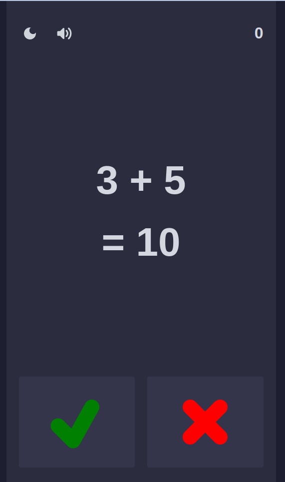

# Quick Math

## Overview

- This game is a clone of [Freak Math](https://play.google.com/store/apps/details?id=com.bangdev.freakingmath&hl=en_US&gl=US) game
- Technologies: ReactJS, Vite, Vitest, Mantine UI, Typescript
- [Demo](https://biem97.github.io/quick-math/)

## How to play

- Use your math skills to answer these equations within 1.5 seconds
